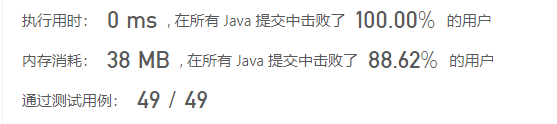

## 剑指 Offer 46. 把数字翻译成字符串

给定一个数字，我们按照如下规则把它翻译为字符串：0 翻译成 “a” ，1 翻译成 “b”，……，11 翻译成 “l”，……，25 翻译成 “z”。一个数字可能有多个翻译。请编程实现一个函数，用来计算一个数字有多少种不同的翻译方法。

 

示例 1:

输入: 12258
输出: 5
解释: 12258有5种不同的翻译，分别是"bccfi", "bwfi", "bczi", "mcfi"和"mzi"
 

提示：

0 <= num < 231

来源：力扣（LeetCode）
链接：https://leetcode.cn/problems/ba-shu-zi-fan-yi-cheng-zi-fu-chuan-lcof
著作权归领扣网络所有。商业转载请联系官方授权，非商业转载请注明出处。

```java
public int translateNum(int num) {
       int temp=num;
        int length=0;
        do{
            length++;
        }
        while((temp=(temp/10))!=0);
        int[] dp=new int[length];
        dp[0]=1;
        int lastValue;
        int currentValue;
        boolean flag=false;
        for(int i=1;i<length;i++){
            lastValue=num%10;
            num/=10;
            currentValue=num%10;
            int combineValue=currentValue*10+lastValue;
            if(flag==true){
                if(combineValue<=25&&currentValue!=0){
                    dp[i]=dp[i-1]+dp[i-2];
                }
                else{
                    dp[i]=dp[i-1];
                    flag=false;
                }
            }
            else if(combineValue<=25&&currentValue!=0) {
                dp[i]=dp[i-1]*2;
                flag=true;
            }else{
                dp[i]=dp[i-1];
                flag=false;
            }
        }
        return dp[length-1];
      
    }
```


