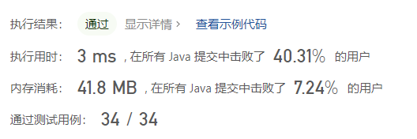
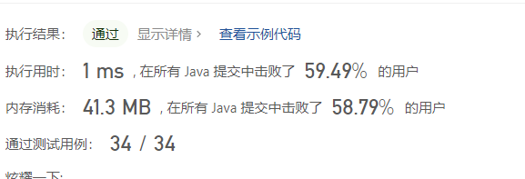

# 左旋字符串

### 个人解法1
```java
class Solution {
    public String reverseLeftWords(String s, int n) {
      char[] arr=s.toCharArray();
      StringBuilder sb=new StringBuilder();
      for(int i=0;i<n;i++){
          sb.append(arr[i]);
      }
      for(int i=n;i<s.length();i++){
          arr[i-n]=arr[i];
      }
      for(int i=s.length()-n,k=0;i<s.length();i++,k++){
          arr[i]=sb.charAt(k);
      }
      return new String(arr);

    }
}
```


### 个人解法2

```java
class Solution {
    public String reverseLeftWords(String s, int n) {
      char[] arr=s.toCharArray();
      int length=s.length();
      reverse(arr,0,length-1);
      reverse(arr,0,length-n-1);
      reverse(arr,length-n,length-1); 
      return new String(arr);
    }

    public void reverse(char[] arr,int start,int end){
        while(start<end){
            char temp=arr[end];
            arr[end]=arr[start];
            arr[start]=temp;
            start++;
            end--;

        }

    }
}
```
