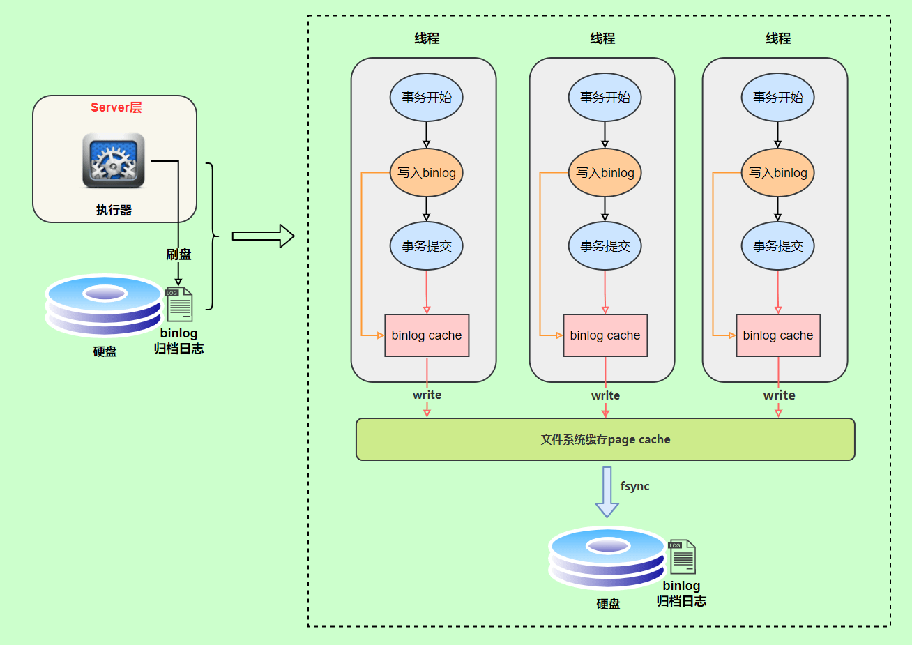

# MySQL三大日志(binlog、redo log和undo log)详解

## 一、redo log
redo log（重做日志）是InnoDB存储引擎独有的，它让MySQL拥有了崩溃恢复能力。比如 MySQL 实例挂了或宕机了，重启时，InnoDB存储引擎会使用redo log恢复数据，保证数据的持久性与完整性。

MySQL 中数据是以页为单位，你查询一条记录，会从硬盘把一页的数据加载出来，加载出来的数据叫数据页，会放入到 Buffer Pool 中。后续的查询都是先从 Buffer Pool 中找，没有命中再去硬盘加载，减少硬盘 IO 开销，提升性能。更新表数据的时候，也是如此，发现 Buffer Pool 里存在要更新的数据，就直接在 Buffer Pool 里更新。然后会把“在某个数据页上做了什么修改”记录到重做日志缓存（redo log buffer）里，接着刷盘到 redo log 文件里。

### 刷盘时机
InnoDB 存储引擎为 redo log 的刷盘策略提供了 innodb_flush_log_at_trx_commit 参数，它支持三种策略：
* 0 ：设置为 0 的时候，表示每次事务提交时不进行刷盘操作
* 1 ：设置为 1 的时候，表示每次事务提交时都将进行刷盘操作（默认值）
* 2 ：设置为 2 的时候，表示每次事务提交时都只把 redo log buffer 内容写入 page cache

innodb_flush_log_at_trx_commit 参数默认为 1 ，也就是说当事务提交时会调用 fsync 对 redo log 进行刷盘另外，InnoDB 存储引擎有一个后台线程，每隔1 秒，就会把 redo log buffer 中的内容写到文件系统缓存（page cache），然后调用 fsync 刷盘。

## 二、binlog
redo log 它是物理日志，记录内容是“在某个数据页上做了什么修改”，属于 InnoDB 存储引擎。
而 binlog 是逻辑日志，记录内容是语句的原始逻辑，类似于“给 ID=2 这一行的 c 字段加 1”，属于MySQL Server 层。
不管用什么存储引擎，只要发生了表数据更新，都会产生 binlog 日志。那 binlog 到底是用来干嘛的？可以说MySQL数据库的数据备份、主备、主主、主从都离不开binlog，需要依靠binlog来同步数据，保证数据一致性。

### 记录格式binlog 日志有三种格式，可以通过binlog_format参数指定。
* statement
* row
* mixed

指定statement，记录的内容是SQL语句原文，比如执行一条`update T set update_time=now() where id=1`，记录的内容如下。

同步数据时，会执行记录的SQL语句，但是有个问题，update_time=now()这里会获取当前系统时间，直接执行会导致与原库的数据不一致。为了解决这种问题，我们需要指定为row，记录的内容不再是简单的SQL语句了，还包含操作的具体数据，记录内容如下。

row格式记录的内容看不到详细信息，要通过mysqlbinlog工具解析出来。update_time=now()变成了具体的时间update_time=1627112756247，条件后面的@1、@2、@3 都是该行数据第 1 个~3 个字段的原始值（假设这张表只有 3 个字段）。
这样就能保证同步数据的一致性，通常情况下都是指定为row，这样可以为数据库的恢复与同步带来更好的可靠性。但是这种格式，需要更大的容量来记录，比较占用空间，恢复与同步时会更消耗IO资源，影响执行速度。
所以就有了一种折中的方案，指定为mixed，记录的内容是前两者的混合。MySQL会判断这条SQL语句是否可能引起数据不一致，如果是，就用row格式，否则就用statement格式

### 写入机制
binlog的写入时机也非常简单，事务执行过程中，先把日志写到binlog cache，事务提交的时候，再把binlog cache写到binlog文件中。
因为一个事务的binlog不能被拆开，无论这个事务多大，也要确保一次性写入，所以系统会给每个线程分配一个块内存作为binlog cache。
我们可以通过binlog_cache_size参数控制单个线程 binlog cache 大小，如果存储内容超过了这个参数，就要暂存到磁盘（Swap）。
binlog日志刷盘流程如下

* 上图的 write，是指把日志写入到文件系统的 page cache，并没有把数据持久化到磁盘，所以速度比较快
* 上图的 fsync，才是将数据持久化到磁盘的操作write和fsync的时机，可以由参数sync_binlog控制，默认是0。

为0的时候，表示每次提交事务都只write，由系统自行判断什么时候执行fsync。

虽然性能得到提升，但是机器宕机，page cache里面的 binlog 会丢失(内存关机断电会丢失数据)。为了安全起见，可以设置为1，表示每次提交事务都会执行fsync，就如同 redo log 日志刷盘流程 一样。
最后还有一种折中方式，可以设置为N(N>1)，表示每次提交事务都write，但累积N个事务后才fsync

## # 两阶段提交
redo log（重做日志）让InnoDB存储引擎拥有了崩溃恢复能力。binlog（归档日志）保证了MySQL集群架构的数据一致性。
虽然它们都属于持久化的保证，但是侧重点不同。
在执行更新语句过程，会记录redo log与binlog两块日志，以基本的事务为单位，redo log在事务执行过程中可以不断写入，而binlog只有在提交事务时才写入，所以redo log与binlog的写入时机不一样。

为了解决两份日志之间的逻辑一致问题，InnoDB存储引擎使用两阶段提交方案。

原理很简单，将redo log的写入拆成了两个步骤prepare和commit，这就是两阶段提交。

使用两阶段提交后，写入binlog时发生异常也不会有影响，因为MySQL根据redo log日志恢复数据时，发现redo log还处于prepare阶段，并且没有对应binlog日志，就会回滚该事务。

## 三、undo log

我们知道如果想要保证事务的原子性，就需要在异常发生时，对已经执行的操作进行回滚，在 MySQL 中，恢复机制是通过 回滚日志（undo log） 实现的，所有事务进行的修改都会先记录到这个回滚日志中，然后再执行相关的操作。如果执行过程中遇到异常的话，我们直接利用 回滚日志 中的信息将数据回滚到修改之前的样子即可！并且，回滚日志会先于数据持久化到磁盘上。这样就保证了即使遇到数据库突然宕机等情况，当用户再次启动数据库的时候，数据库还能够通过查询回滚日志来回滚将之前未完成的事务。

另外，MVCC 的实现依赖于：隐藏字段、Read View、undo log。在内部实现中，InnoDB 通过数据行的 DB_TRX_ID 和 Read View 来判断数据的可见性，如不可见，则通过数据行的 DB_ROLL_PTR 找到 undo log 中的历史版本。每个事务读到的数据版本可能是不一样的，在同一个事务中，用户只能看到该事务创建 Read View 之前已经提交的修改和该事务本身做的修改
