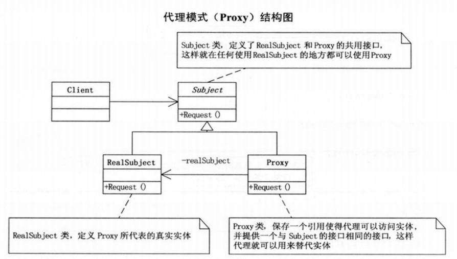

# java动态代理实现与原理详细分析 

## 一、代理模式
   代理模式是常用的java设计模式，他的特征是代理类与委托类有同样的接口，代理类主要负责为委托类预处理消息、过滤消息、把消息转发给委托类，以及事后处理消息等。代理类与委托类之间通常会存在关联关系，一个代理类的对象与一个委托类的对象关联，代理类的对象本身并不真正实现服务，而是通过调用委托类的对象的相关方法，来提供特定的服务。简单的说就是，我们在访问实际对象时，是通过代理对象来访问的，代理模式就是在访问实际对象时引入一定程度的间接性，因为这种间接性，可以附加多种用途。在后面我会
   
解释这种间接性带来的好处。代理模式结构图（图片来自《大话设计模式》）：



## 二、静态代理

**静态代理简单实现**

```java
/**
 * 创建Person接口
 * @author Gonjan
 */
public interface Person {
    //上交班费
    void giveMoney();
}
```

Student类实现Person接口。Student可以具体实施上交班费的动作。

```java
public class Student implements Person {
    private String name;
    public Student(String name) {
        this.name = name;
    }
    
    @Override
    public void giveMoney() {
       System.out.println(name + "上交班费50元");
    }
}
```

StudentsProxy类，这个类也实现了Person接口，但是还另外持有一个学生类对象，由于实现了Peson接口，同时持有一个学生对象，那么他可以代理学生类对象执行上交班费（执行giveMoney()方法）行为。

```java
/**
 * 学生代理类，也实现了Person接口，保存一个学生实体，这样既可以代理学生产生行为
 * @author Gonjan
 *
 */
public class StudentsProxy implements Person{
    //被代理的学生
    Student stu;
    
    public StudentsProxy(Person stu) {
        // 只代理学生对象
        if(stu.getClass() == Student.class) {
            this.stu = (Student)stu;
        }
    }
    
    //代理上交班费，调用被代理学生的上交班费行为
    public void giveMoney() {
        stu.giveMoney();
    }
}
```
下面测试一下，看如何使用代理模式：
```java
public class StaticProxyTest {
    public static void main(String[] args) {
        //被代理的学生张三，他的班费上交有代理对象monitor（班长）完成
        Person zhangsan = new Student("张三");
        
        //生成代理对象，并将张三传给代理对象
        Person monitor = new StudentsProxy(zhangsan);
        
        //班长代理上交班费
        monitor.giveMoney();
    }
}
```

故此只需要在StudentsProxy重写的givemoney方法中就可以实现在student.givemoney()方法前后添加要执行的操作了，student.givemoney在这里就相当于一个pointcut

## 三、JDK动态代理原理分析
jdk代理的核心就是实现InvocationHandler,并重写invoke方法执行一些切入前或者切入后的操作
```java
public class AdminInvocationHandler<T> implements InvocationHandler {

    public T target;
    public AdminInvocationHandler(T target){
        this.target=target;
    }
    @Override
    public Object invoke(Object proxy, Method method, Object[] args) throws Throwable {
        System.out.println("当前执行的方法名:"+method.getName());
        Long start=System.currentTimeMillis();
        //在方法被真正执行前插入一些操作
        Object result= method.invoke(target,args);
        //在方法被真正执行后插入一些操作
        Long end=System.currentTimeMillis();
        System.out.println("方法执行耗时："+(end-start)+"ms");
        return result;
    }
}
```
通过proxy类中的静态方法newProxyInstance创建代理类对象实例
```java
User adminproxy= (User) Proxy.newProxyInstance(User.class.getClassLoader(),new Class<?>[]{User.class},invocationHandler);
```
其参数详解
```
                                          ClassLoader loader,
                                          Class<?>[] interfaces,
                                          InvocationHandler h)
Params:
loader – the class loader to define the proxy class
interfaces – the list of interfaces for the proxy class to implement
h – the invocation handler to dispatch method invocations to
```
由官方注解给出的说明可以得知，
* 第一个参数代表代理类的类加载器
* 第二个参数代表代理类的父接口
* 第三个参数需要我们自定义一个类去实现InvocationHandler接口，将其实例对象传入即可

利用Proxy类的newProxyInstance方法创建了一个动态代理对象，查看该方法的源码，发现它只是封装了创建动态代理类的步骤(红色标准部分)：

```java
public static Object newProxyInstance(ClassLoader loader,
                                          Class<?>[] interfaces,
                                          InvocationHandler h)
        throws IllegalArgumentException
    {
        Objects.requireNonNull(h);

        final Class<?>[] intfs = interfaces.clone();
        final SecurityManager sm = System.getSecurityManager();
        if (sm != null) {
            checkProxyAccess(Reflection.getCallerClass(), loader, intfs);
        }

        /*
         * Look up or generate the designated proxy class.
         */
        Class<?> cl = getProxyClass0(loader, intfs);

        /*
         * Invoke its constructor with the designated invocation handler.
         */
        try {
            if (sm != null) {
                checkNewProxyPermission(Reflection.getCallerClass(), cl);
            }

            final Constructor<?> cons = cl.getConstructor(constructorParams);
            final InvocationHandler ih = h;
            if (!Modifier.isPublic(cl.getModifiers())) {
                AccessController.doPrivileged(new PrivilegedAction<Void>() {
                    public Void run() {
                        cons.setAccessible(true);
                        return null;
                    }
                });
            }
            return cons.newInstance(new Object[]{h});
        } catch (IllegalAccessException|InstantiationException e) {
            throw new InternalError(e.toString(), e);
        } catch (InvocationTargetException e) {
            Throwable t = e.getCause();
            if (t instanceof RuntimeException) {
                throw (RuntimeException) t;
            } else {
                throw new InternalError(t.toString(), t);
            }
        } catch (NoSuchMethodException e) {
            throw new InternalError(e.toString(), e);
        }
    }
```
## 四、总结
生成的代理类：$Proxy0 extends Proxy implements Person，我们看到代理类继承了Proxy类，所以也就决定了java动态代理只能对接口进行代理，Java的继承机制注定了这些动态代理类们无法实现对class的动态代理。
上面的动态代理的例子，其实就是AOP的一个简单实现了，在目标对象的方法执行之前和执行之后进行了处理，对方法耗时统计。Spring的AOP实现其实也是用了Proxy和InvocationHandler这两个东西的。

## 五、Cglib动态代理
先导入依赖包
```
<dependency>
    <groupId>cglib</groupId>
    <artifactId>cglib</artifactId>
    <version>3.1</version>
</dependency>
```
只看一下MethodInterceptor和InvocationHandler两种，其他毕竟用得少：
* InvocationHandler：用法和JDK动态代理一样，参考JDK的即可
* MethodInterceptor：